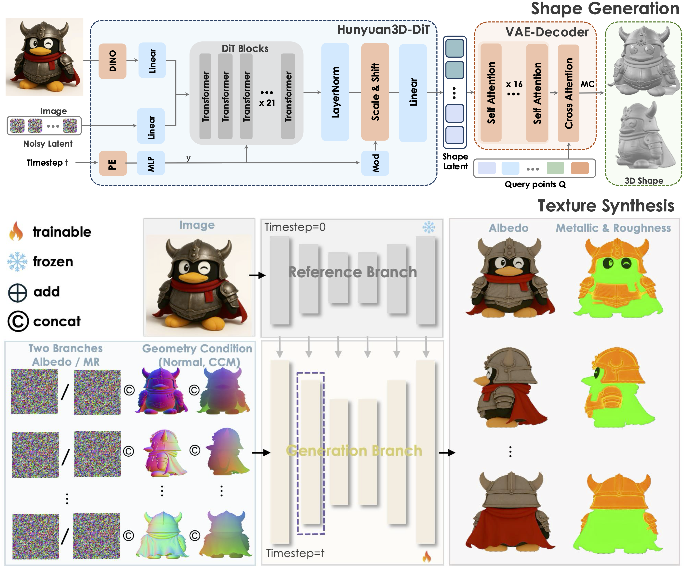

## How to install
- Install CUDA 12.4 from <https://developer.nvidia.com/cuda-12-4-0-download-archive>
- Set CUDA path in `~/.bashrc`.
- Either:
  - Use `condarequirements.yaml` to make a Conda venv and to install Pytorch, Pytorch Lightning, etc.
  - Run `tmp.sh` to install Pytorch, Pytorch Lightning, etc.

## Test image-to-3D
- `demo.py` : Generates 3D object with a single image.
- `--img_name_in_asset` : Use this option to select specific image to test.
  - `--img_name_in_asset toilet_img_0008` : Generate a 3D object from `assets/toilet_img_0008.png`.
- Generating a 3D object takes around 1 minute.

## Test finetuning hy3dshape
- `cd ./hy3dshape && bash fixed_train_launch.sh`
- `fixed_train_launch.sh` executes training(overfitting) for example dataset in `hy3dshape/tools/mini_trainset/preprocessed`.
- Training config file is `hy3dshape/configs/hunyuandit-mini-overfitting-flowmatching-dinol518-bf16-lr1e4-4096.yaml`.
- Only for training a 3D shape generator.
- Even with extensive fix, multi-gpu training fails.
- With A6000(48GB VRAM), single iteration task 2 seconds with `batch_size=2`.

## Below is the original readme.md in Hunyuan-2.1

## 🔥 News

- Jul 26, 2025: 🤗 We release the first open-source, simulation-capable, immersive 3D world generation model, [HunyuanWorld-1.0](https://github.com/Tencent-Hunyuan/HunyuanWorld-1.0)!
- Jun 19, 2025: 👋 We present the [technical report](https://arxiv.org/pdf/2506.15442) of Hunyuan3D-2.1, please check out the details and spark some discussion!
- Jun 13, 2025: 🤗 We release the first production-ready 3D asset generation model, Hunyuan3D-2.1!

> Join our **[Wechat](#)** and **[Discord](https://discord.gg/dNBrdrGGMa)** group to discuss and find help from us.

| Wechat Group                                     | Xiaohongshu                                           | X                                           | Discord                                           |
|--------------------------------------------------|-------------------------------------------------------|---------------------------------------------|---------------------------------------------------|
|  |  |  |  |        

## 🤗 Community Contribution Leaderboard
1. By [@visualbruno](https://github.com/visualbruno)
  - ComfyUI-Hunyuan3d-2-1: https://github.com/visualbruno/ComfyUI-Hunyuan3d-2-1
2. By [@VR-Jobs](https://github.com/VR-Jobs)
  - Hunyuan3d-2-1 Unity Support: https://github.com/VR-Jobs/Hunyuan3D-2.1-Unity-XR-PC-Phone

## ☯️ **Hunyuan3D 2.1**

### Architecture

Tencent Hunyuan3D-2.1 is a scalable 3D asset creation system that advances state-of-the-art 3D generation through two pivotal innovations: Fully Open-Source Framework and  Physically-Based Rendering (PBR) Texture Synthesis. For the first time, the system releases full model weights and training code, enabling community developers to directly fine-tune and extend the model for diverse downstream applications. This transparency accelerates academic research and industrial deployment. Moreover, replacing the prior RGB-based texture model, the upgraded PBR pipeline leverages  physics-grounded material simulation  to generate textures with photorealistic light interaction (e.g., metallic reflections, subsurface scattering).

<p align="left">
  
</p>

### Performance

We have evaluated Hunyuan3D 2.1 with other open-source as well as close-source 3d-generation methods.
The numerical results indicate that Hunyuan3D 2.1 surpasses all baselines in the quality of generated textured 3D assets
and the condition following ability.

| Model                   | ULIP-T(⬆)   | ULIP-I(⬆) | Uni3D-T(⬆)      | Uni3D-I(⬆) |
|-------------------------|-----------|-------------|-------------|---------------|
| Michelangelo  | 0.0752     | 0.1152      | 0.2133     | 0.2611         |
| Craftsman | 0.0745     | 0.1296      | 0.2375     | 0.2987         |
| TripoSG | 0.0767     | 0.1225      | 0.2506     | 0.3129       |
| Step1X-3D | 0.0735     | 0.1183      | 0.2554     | 0.3195         |
| Trellis | 0.0769     | 0.1267      | 0.2496     | 0.3116         |
| Direct3D-S2 | 0.0706     | 0.1134      | 0.2346     | 0.2930         |
| Hunyuan3D-Shape-2.1           | **0.0774** | **0.1395**  | **0.2556** | **0.3213** |


| Model                   | CLIP-FiD(⬇)   | CMMD(⬇) | CLIP-I(⬆)      | LPIPS(⬇) |
|-------------------------|-----------|-------------|-------------|---------------|
| SyncMVD-IPA  | 28.39     | 2.397      | 0.8823     | 0.1423         |
| TexGen | 28.24     | 2.448      | 0.8818     | 0.1331         |
| Hunyuan3D-2.0 | 26.44     | 2.318     | 0.8893     | 0.1261         |
| Hunyuan3D-Paint-2.1           | **24.78** | **2.191**  | **0.9207** | **0.1211**     |


## 🎁 Models Zoo

It takes 10 GB VRAM for shape generation, 21GB for texture generation and 29GB for shape and texture generation in total.


| Model                      | Description                 | Date       | Size | Huggingface                                                                               |
|----------------------------|-----------------------------|------------|------|-------------------------------------------------------------------------------------------| 
| Hunyuan3D-Shape-v2-1         | Image to Shape Model        | 2025-06-14 | 3.3B | [Download](https://huggingface.co/tencent/Hunyuan3D-2.1/tree/main/hunyuan3d-dit-v2-1)         |
| Hunyuan3D-Paint-v2-1       | Texture Generation Model    | 2025-06-14 | 2B | [Download](https://huggingface.co/tencent/Hunyuan3D-2.1/tree/main/hunyuan3d-paintpbr-v2-1)       |


## 🤗 Get Started with Hunyuan3D 2.1

Hunyuan3D 2.1 supports Macos, Windows, Linux. You may follow the next steps to use Hunyuan3D 2.1 via:

### Install Requirements
We test our model with Python 3.10 and PyTorch 2.5.1+cu124.
```bash
pip install torch==2.5.1 torchvision==0.20.1 torchaudio==2.5.1 --index-url https://download.pytorch.org/whl/cu124
pip install -r requirements.txt

cd hy3dpaint/custom_rasterizer
pip install -e .
cd ../..
cd hy3dpaint/DifferentiableRenderer
bash compile_mesh_painter.sh
cd ../..

wget https://github.com/xinntao/Real-ESRGAN/releases/download/v0.1.0/RealESRGAN_x4plus.pth -P hy3dpaint/ckpt
```

### Code Usage

We designed a diffusers-like API to use our shape generation model - Hunyuan3D-Shape and texture synthesis model -
Hunyuan3D-Paint.

```python
import sys
sys.path.insert(0, './hy3dshape')
sys.path.insert(0, './hy3dpaint')
from textureGenPipeline import Hunyuan3DPaintPipeline
from textureGenPipeline import Hunyuan3DPaintPipeline, Hunyuan3DPaintConfig
from hy3dshape.pipelines import Hunyuan3DDiTFlowMatchingPipeline

# let's generate a mesh first
shape_pipeline = Hunyuan3DDiTFlowMatchingPipeline.from_pretrained('tencent/Hunyuan3D-2.1')
mesh_untextured = shape_pipeline(image='assets/demo.png')[0]

paint_pipeline = Hunyuan3DPaintPipeline(Hunyuan3DPaintConfig(max_num_view=6, resolution=512))
mesh_textured = paint_pipeline(mesh_path, image_path='assets/demo.png')
```


### Gradio App

You could also host a [Gradio](https://www.gradio.app/) App in your own computer via:


```bash
python3 gradio_app.py \
  --model_path tencent/Hunyuan3D-2.1 \
  --subfolder hunyuan3d-dit-v2-1 \
  --texgen_model_path tencent/Hunyuan3D-2.1 \
  --low_vram_mode
```


## 🔗 BibTeX

If you found this repository helpful, please cite our reports:

```bibtex
@misc{hunyuan3d2025hunyuan3d,
    title={Hunyuan3D 2.1: From Images to High-Fidelity 3D Assets with Production-Ready PBR Material},
    author={Tencent Hunyuan3D Team},
    year={2025},
    eprint={2506.15442},
    archivePrefix={arXiv},
    primaryClass={cs.CV}
}

@misc{hunyuan3d22025tencent,
    title={Hunyuan3D 2.0: Scaling Diffusion Models for High Resolution Textured 3D Assets Generation},
    author={Tencent Hunyuan3D Team},
    year={2025},
    eprint={2501.12202},
    archivePrefix={arXiv},
    primaryClass={cs.CV}
}

@misc{yang2024hunyuan3d,
    title={Hunyuan3D 1.0: A Unified Framework for Text-to-3D and Image-to-3D Generation},
    author={Tencent Hunyuan3D Team},
    year={2024},
    eprint={2411.02293},
    archivePrefix={arXiv},
    primaryClass={cs.CV}
}
```

## Acknowledgements

We would like to thank the contributors to
the [TripoSG](https://github.com/VAST-AI-Research/TripoSG), [Trellis](https://github.com/microsoft/TRELLIS),  [DINOv2](https://github.com/facebookresearch/dinov2), [Stable Diffusion](https://github.com/Stability-AI/stablediffusion), [FLUX](https://github.com/black-forest-labs/flux), [diffusers](https://github.com/huggingface/diffusers), [HuggingFace](https://huggingface.co), [CraftsMan3D](https://github.com/wyysf-98/CraftsMan3D), [Michelangelo](https://github.com/NeuralCarver/Michelangelo/tree/main), [Hunyuan-DiT](https://github.com/Tencent-Hunyuan/HunyuanDiT), and [HunyuanVideo](https://github.com/Tencent-Hunyuan/HunyuanVideo) repositories, for their open research and
exploration.

## Star History

<a href="https://star-history.com/#Tencent-Hunyuan/Hunyuan3D-2.1&Date">
 <picture>
   <source media="(prefers-color-scheme: dark)" srcset="https://api.star-history.com/svg?repos=Tencent-Hunyuan/Hunyuan3D-2.1&type=Date&theme=dark" />
   <source media="(prefers-color-scheme: light)" srcset="https://api.star-history.com/svg?repos=Tencent-Hunyuan/Hunyuan3D-2.1&type=Date" />
   
 </picture>
</a>
